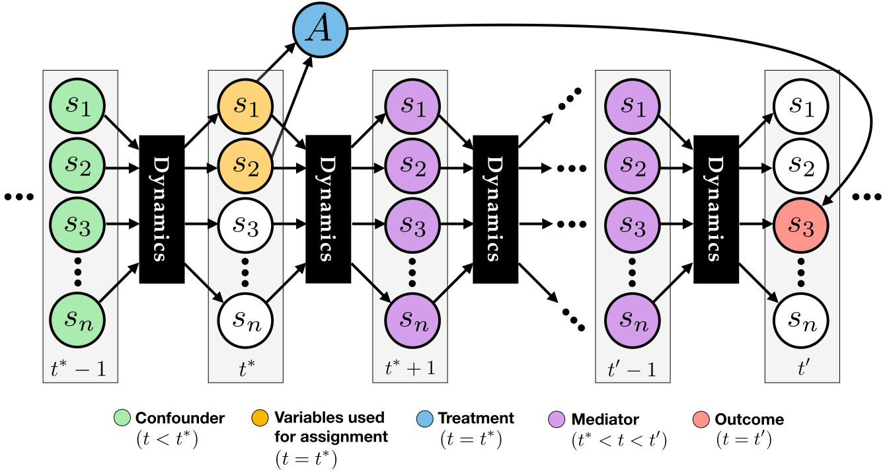

Why WhyNot?
===========
WhyNot supports multiple use cases, some technical, some pedagogical, each
suited for a different group of users. We envision at least five primary use
cases.

*Developing*: Researchers can use WhyNot in the process of developing new
methods for causal inference and decision making in dynamics. WhyNot can serve
as a substitute for ad-hoc synthetic data where needed, providing a greater set
of challenging test cases.

*Testing*: Researchers can use WhyNot to design robustness checks for methods
and gain insight into the failure cases of these methods.

*Benchmarking*: Practitioners can use WhyNot to compare multiple methods on the
same set of tasks. WhyNot does not dictate any particular benchmark. Rather
is an experimental platform for creating challenging test cases using computer
simulations, supporting the community in creating useful benchmarks.

*Learning*: Students of causality and sequential decision making might find
WhyNot to be a helpful training resource. WhyNot is easy-to-use and it does not
require much prior experience to get started.

*Teaching*: Instructors can use WhyNot as a tool students engage with to learn
and solve problems.

WhyNot provides:

* A diverse set of complex simulated environments (:ref:`simulators`)
* A suite of state-of-the-art causal inference methods (:ref:`estimators`)
* An extensive collection of experimental design examples (:ref:`experiment-examples`)
* An extensible, easy-to-use framework that makes it easy to add more experiments, estimators, and simulators.

Why Simulations?
----------------
Almost as old as the digital computer is the idea of computer simulation of
mathematical models designed to capture aspects of the real world. Dating back
to the mid-1950s, a field known as system dynamics sought to derive policy
recommendations from computer simulations of dynamical systems in a variety of
domains, ranging from industrial management and urban planning to environmental
forecasting.  Similarly, agent-based modeling—an active research area with
applications ranging from economics to epidemiology—simulates the collective
interactions of many agents. Robotics, control theory, and reinforcement
learning all actively deploy simulated environments to improve systems and
anticipate their failure points. *As computational resources continue to grow,
simulation will become an increasingly powerful tool.*

While the realism and utility of these simulations can (and do) vary, they
possess characteristics useful for researchers asking causal questions: They do
not encode predetermined causal questions or answers, and they exhibit many of
the same properties of dynamical systems in the real world.

Beyond causal inference, machine learning to date struggles to perform well
inside social dynamics. The reasons are numerous and fundamental in their
nature. Static training data sets poorly capture the complexity of how social
dynamics evolve. Strategic responses to decision rules can render statistical
regularities obsolete. Correlations observed in data may not be robust enough to
support meaningful interventions. Fairness concerns arise when the negative
externalities of classification disproportionately affect some groups in the
population. Where mathematical analysis is not possible, simulation offers a
powerful tool to model and understand the interplay between machine learning and
dynamics.

WhyNot connects computer simulation and causal inference and decision making in
dynamics by using the former as a testbed for the latter. Simulation inevitably
shows discrepancies with the real world. `But even when a simulator fails to
faithfully represent the real world, it can nonetheless provide a valuable
environment in which causal questions have non-trivial answers`. Ground truth is
available through simulation where formal analysis is impenetrable. Each
simulator we consider naturally leads to a range of dynamics and causal
questions by varying which variables to include, what time horizons to consider,
and how to generate data from the simulator. With this powerful tool at hand, we
can investigate how today's practice of machine learning and causal inference
fares in challenging simulated environments.

Dynamical Systems and Causal Inference
--------------------------------------
Causal inference inevitably has to grapple with data generated by some dynamical
process, since the physical universe is itself a dynamical system. Dynamical
system models provide a natural and convenient setting for researchers to study
causal inference. WhyNot offers an environment to test the capabilities and
limitations of these methodologies in simulated worlds with dynamic
characteristics which mirror those of our own.

In discrete time, a dynamical system consists of a state :math:`x`, a set of
parameters :math:`\theta`, and a state-transition function :math:`f`, which
evolves the state at time :math:`t` according to

.. math::

    x_{t+1} = f(x_{t}; \theta).

An intervention in these systems corresponds to changing the state-transition
rule from :math:`f` to :math:`f'` at an intervention time :math:`t^*`, and then
evolving the system according to :math:`f'` after time :math:`t^*`. The outcome
variable is a measurement of the state :math:`x_{t'}` at some time :math:`t'` in
the future. For example, in the context of a city simulation, the intervention
could correspond to raising the minimum wage at time :math:`t^*`, and the
outcome variable could be the level of unemployment at time :math:`t'`.

Dynamical systems are a compelling choice as data generating processes for
causal inference not least because *the temporal structure of the dynamics
naturally gives rise to confounding and mediation*. A confounder has a causal
effect on both the treatment and the outcome. In a dynamical system, even if
each component of the initial state is independent, the dynamics generally
*couple the past* and render all of the state variables dependent. Thus, the
entire collection of state variables from time :math:`t=0` to :math:`t=t^*-1`
are confounders. Similarly, a mediator is causally affected by the treatment
assignment and affects the outcome variable, and so all of the state variables
from time :math:`t=t^*+1` to :math:`t=t'-1` are mediating variables. This
mechanism of confounding and mediation is illustrated below.

This connection between dynamics and questions of confounding and mediation
provides the conceptual link between causal inference and dynamical systems. By
simulating and intervening on a wide array of dynamics, we can generate a wide
array of non-trivial causal inference problems.

Related Projects
----------------
* `DoWhy <https://github.com/Microsoft/dowhy>`_
* `CauseMe <https://causeme.uv.es>`_
* `CausalML <https://github.com/uber/causalml>`_
* `EconML <https://github.com/microsoft/EconML>`_
* `ACC Causal Inference Competitions <https://arxiv.org/abs/1707.02641>`_
* `ML-fairness-gym <https://github.com/google/ml-fairness-gym>`_
